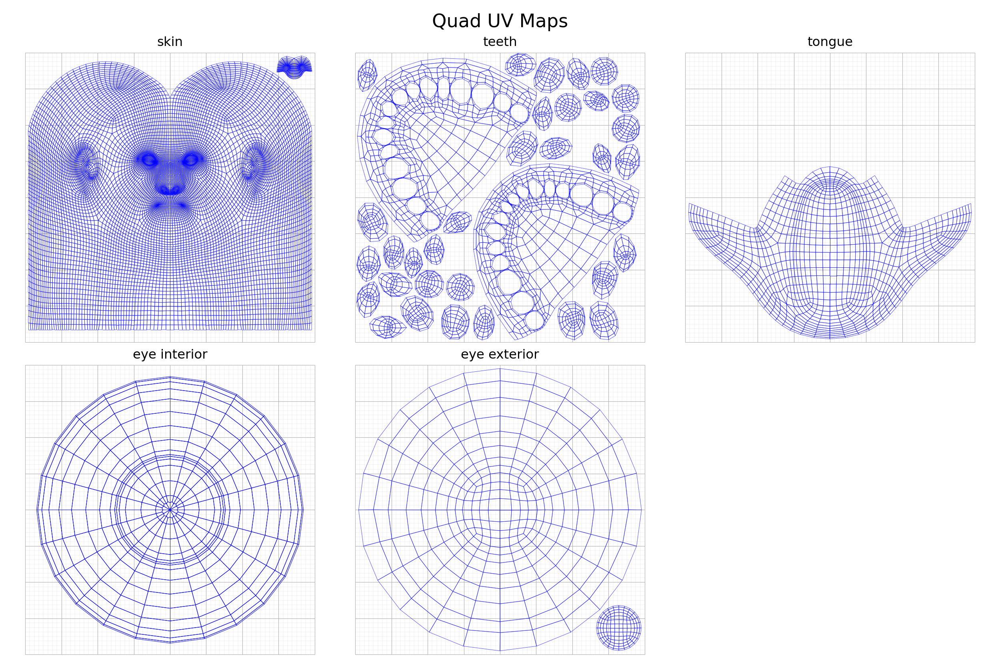

# GNM: Generative aNthropometric Model

[](https://arxiv.org/abs/2607.23687)
[](https://github.com/google/gnm/actions/workflows/ci-shape-linux.yml)
[](https://github.com/google/gnm/actions/workflows/ci-shape-macos.yml)
[](https://github.com/google/gnm/actions/workflows/ci-shape-windows.yml)
[](https://github.com/google/gnm/actions/workflows/lint.yml)

**GNM** is a state-of-the-art parametric 3D statistical model of the human head,
learned from a large dataset of 3D scans. It provides fine-grained control over
facial identity, expressions, and head pose. This package contains the core
NumPy, JAX, PyTorch, and TensorFlow based GNM shape model implementations, along
with tools for visualization and semantic sampling of parameters.


## Features

*   **Detailed 3D Face Geometry:** Generates a dense 3D face mesh comprised of the skin, the eyes, the teeth, and the tongue.
*   **Disentangled Control:** Offers separate parameters for:
    *   **Identity:** Controls subject-specific facial features.
    *   **Expression:** Animates the face with a rich set of expression blendshapes.
    *   **Head Pose:** Controls the rotation of the neck and eyeballs.
    *   **Translation:** Controls the global position.
*   **Semantic Parameter Sampling:** Includes pre-trained models to generate identity and expression parameters from semantic labels:
    *   `ExpressionSampler`: Generate expressions like "happy", "surprise", or blend them.
    *   `IdentitySampler`: Generate identities based on attributes like gender and ethnicity.
*   **Multi-Framework Support:** Native backend support for **NumPy**, **JAX**, **PyTorch**, and **TensorFlow**.
*   **Permissive License:** Apache 2.0.

## Project Structure

```text
gnm/shape/
├── data/                   # GNM model assets and versions
│   ├── textures/           # Model textures (.jpg, .png)
│   ├── semantic_sampler/   # Pre-trained .h5 semantic sampling models
│   └── versions/
│       └── v3_0/           # Contains v3 GNM model files (.npz)
├── demos/                  # Interactive demo notebooks (.ipynb)
├── fitting_utils/          # Shared optimization helper functions
├── visualization/          # Rendering and camera projection utilities
├── gnm_base.py             # Base GNM class definitions
├── gnm_colab_viewer.py     # Colab 3D face model visualization tool
├── gnm_data_loader.py      # Dynamic model loaders and checkers
├── gnm_data_schema.py      # Input/output data validation schemas
├── gnm_jax.py              # JAX implementation of GNM
├── gnm_numpy.py            # NumPy implementation of GNM (primary)
├── gnm_pytorch.py          # PyTorch implementation of GNM
├── gnm_tensorflow.py       # TensorFlow implementation of GNM
├── pyproject.toml          # Package build & optional dependency configuration
└── semantic_sampler.py     # Semantic parameter sampling (identities/expressions)
```

## Installation

### 1. Prerequisites
GNM Shape is tested with **Python 3.13**. Before installing, create and activate
a clean virtual environment using your preferred tool
(e.g. mamba/conda, venv, uv etc.):

```bash
mamba create -n gnm python=3.13
mamba activate gnm
```


### 2. Install GNM Shape
Clone the repository and install the package using `pip` into your active
environment. You can install only the backend frameworks you need:

```bash
git clone https://github.com/google/gnm.git
cd gnm/gnm/shape
```

*   **Core (NumPy + TensorFlow only):**

    ```bash
    pip install -e .
    ```

*   **With JAX support:**

    ```bash
    pip install -e ".[jax]"
    ```

*   **With PyTorch support:**

    ```bash
    pip install -e ".[pytorch]"
    ```

*   **All supported frameworks and development tools:**

    ```bash
    pip install -e ".[all,dev]"
    ```

## Getting Started

### Loading the GNM Model

The core model can be loaded as follows. The necessary model data (`gnm.npz`)
is included in this repository.

```python
from gnm.shape import gnm_numpy
from gnm.shape import semantic_sampler
import numpy as np
import trimesh # For visualization

# Load the GNM head model.
gnm = gnm_numpy.GNM.from_local(
    version=gnm_numpy.GNMMajorVersion.V3,
    variant=gnm_numpy.GNMVariant.HEAD,
)

# Get the template (average) face mesh.
template_vertices = gnm.template_vertex_positions
faces = gnm.triangles

# Save or visualize the mesh (example using trimesh).
mesh = trimesh.Trimesh(vertices=template_vertices, faces=faces, process=False)
# mesh.show()
mesh.export("template_face.obj")
```

### Basic Parameter Manipulation
You can generate a mesh by providing parameters for identity, expression,
joint rotations, and translation.

```python
import trimesh

# Zero parameters result in the template face.
identity = np.zeros(gnm.identity_dim)
expression = np.zeros(gnm.expression_dim)
rotations = np.zeros((gnm.num_joints, 3)) # Axis-angle
translation = np.zeros((3,))

vertices = gnm(identity, expression, rotations, translation)
mesh = trimesh.Trimesh(vertices=vertices, faces=faces, process=False)
mesh.show()
```

### Demo

To experiment with generating a human head mesh from custom identity,
expression, joint rotations and global translation, please see
`gnm/shape/demos/gnm_head_demo.ipynb`.


## Using the Semantic Sampler
Generate meaningful identity and expression parameters using the
`ExpressionSampler` and `IdentitySampler`.

### Expression Sampling
```python
expr_sampler = semantic_sampler.ExpressionSampler()

# Available expression labels.
print(expr_sampler.expression_label_mapping)

# Sample a 'happy' expression.
happy_expression = expr_sampler.sample_expression(
    semantic_sampler.Expression.HAPPY, num_samples=1
)[0]

vertices_happy = gnm(expression=happy_expression)
mesh_happy = trimesh.Trimesh(vertices=vertices_happy, faces=faces)
mesh_happy.show()
mesh_happy.export("happy_face.obj")
```

### Identity Sampling
```python
id_sampler = semantic_sampler.IdentitySampler()

# Explain available classes.
print(id_sampler.explain_classes())

# Sample a specific identity.
identity_sample = id_sampler.sample_identity(
    semantic_sampler.Gender.FEMALE,
    semantic_sampler.Ethnicity.ASIAN,
    num_samples=1
)[0]

vertices_identity = gnm(identity=identity_sample)
mesh_identity = trimesh.Trimesh(vertices=vertices_identity, faces=faces)
mesh_identity.show()
mesh_identity.export("sampled_identity_face.obj")
```

### Demo
To experiment with identity and expression sampling and blending, please see
`gnm/shape/demos/semantic_gnm_demo.ipynb`.


## XR Blocks Demo

Check out the interactive [XR Blocks GNM Head Demo](https://xrblocks.github.io/docs/samples/GNM-Head/) (courtesy of Ruofei Du), which works on XR devices (best in Android XR), mobile phones as well as desktop browser. The demo showcases the GNM Head model including 3D face geometry, identity and expression parameter tuning, and semantic sampling. The source code can be found on [github.com/google/xrblocks/tree/main/demos/gnm](https://github.com/google/xrblocks/tree/main/demos/gnm)


## Model Parameters

The GNM model is controlled by two primary sets of coefficients that determine
the identity and expression of the generated face. The following dimensions are
relevant for the GNM v3.x.

### Identity Parameters

*   **Shape:** `[batch_size, 253]`
*   **Description:** Controls the unique physical characteristics of the individual. These are divided into:
    *   **170** Head components
    *   **3** Eyeball components
    *   **80** Teeth components
*   **Total:** 253 identity components.
*   **Typical Range:** -3 to +3

### Expression Parameters

*   **Shape:** `[batch_size, 383]`
*   **Description:** Controls the facial movement and blendshape weights. These are divided into:
    *   **100** Left eye components
    *   **100** Right eye components
    *   **150** Lower face components
    *   **32** Tongue components
    *   **1** Iris component
*   **Total:** 383 expression components.
*   **Typical Range:** -3 to +3.

### Joint Parameters

*   **Shape:** rotations: `[batch_size, 4x3 Rotation matrix]`, global translation: `[batch_size, 3]`
*   **Description:** Controls the global head position and joint angles for head pose and eyeball orientation.

## Model Data
The GNM model data (e.g., `gnm_head.npz`) contains the template shape, identity
basis, expression basis, skinning weights, and UV layout. This file is provided
within the `gnm/shape/data/versions/v{MAJOR}_{MINOR}` directory.

The Semantic Sampler models
(`expression_decoder_model.h5`, `identity_decoder_model.h5`) are located
in `gnm/shape/data/semantic_sampler`.

## UV Mapping

The GNM head mesh features a structured UV layout divided into five logical
regions:

| Region | Description | Vertex Groups |
| :--- | :--- | :--- |
| **Skin** | The head and face skin. | `skin` |
| **Teeth** | Upper and lower teeth and gums. | `upper_teeth_and_gums` / `lower_teeth_and_gums` |
| **Tongue** | The tongue. | `tongue` |
| **Eye Interior** | Internal eye structures (sclera, pupil, iris). | `eye_interiors` |
| **Eye Exterior** | External eye structures (cornea). | `eye_exteriors` |

We provide UV coordinates for both the quad topology (`quad_uvs`, shape
`[Q, 4, 2]`) and the triangulated topology (`triangle_uvs`, shape `[T, 3, 2]`).
Left and right eye UVs are mapped to the same UV space regions (overlapping) to
optimize texture space. Below is the visualization of the edge flow for the quad
UV map. A similar layout is available for the triangulated version.



## Model Limitations in Human Representation
This model was trained on datasets using binary gender categories and four broad
demographic groups based on conventions in 3DMM literature and data
availability. These categories do not fully represent the spectrum of human
gender identities or the full diversity of the global population. Please see the
technical report for a more detailed discussion of these limitations and the
dataset statistics. Users should be aware of these limitations and consider the
potential implications for fairness and representation in their specific
applications.

## Technical Report

To learn more about the technical details including the formal model definition, evaluation on downstream tasks, comparison to SotA as well as data provenance, please read the [technical report](https://arxiv.org/abs/2607.23687).

## Citation

```bash
@article{ploumpis2026gnmhead,
  title={GNM Head: A Generative aNthropometric Model of the human head},
  author={Ploumpis, S. and Bednarik, J. and Zoss, G. and Guseinov, R. and Prasso, L. and Chandran, P. and Boyne, O. and Choutas, V. and Bolkart, T. and Wang, D. and Chai, M. and Qiu, D. and Winberg, S. and Rainer, G. and Bridgeman, L. and Vicini, D. and Riviere, J. and Boetzel, Y. and Koumis, A. and Busch, J. and Herrera, C. and Still, J. and Ysebert, S. and Lincoln, P. and Escolano, S. O. and Rhemann, C. and Wood, E. and Beeler, T. and Zafeiriou, S.},
  year={2026},
  eprint={2607.23687},
  archivePrefix={arXiv},
  url={https://arxiv.org/abs/2607.23687},
}
```

## Contributing
We'd love to accept your patches and contributions to this project! See
[CONTRIBUTING.md](CONTRIBUTING.md) for more information on how to get started
and how we handle external contributions.

## License
This project is licensed under the Apache License, Version 2.0. See the
[LICENSE](LICENSE) file for details.
